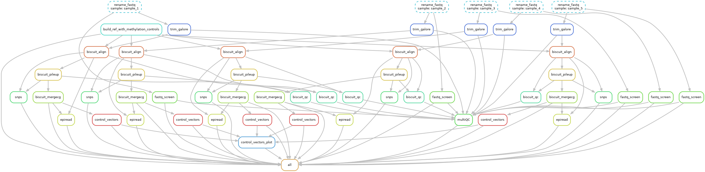

# WGBS workflow

This workflow takes raw, paired-end whole-genome bisultite sequencing (WGBS) data and extracts methylation information and does bisulfite-specific QC.
The workflow centers around Biscuit, a tool for mapping and analyzing WGBS data: https://huishenlab.github.io/biscuit/. Download biscuit here: https://github.com/huishenlab/biscuit/releases/latest.

## Running the workflow
+ Clone the repo `git clone https://github.com/vari-bbc/WGBS_Biscuit_Snakemake`
+ Load your gzipped reads into `raw_data/`
+ Setup a sample sheet in `src/samples.tsv` containing:
	+ a row for each sample
	+ three columns (feel free to include any other columns as needed, these are ignored):
		1. `sample`
		2. `fq1` (name of R1 file for sample in `raw_data/`)
		3. `fq2` (name of R2 file for sample in `raw_data/`)
+ Modify the config.yaml to specify the appropriate 
	+ reference, 
	+ biscuit index
	+ biscuit QC assets
	+ environment modules (If you do not have these modules, the executables for the required programs are in the path. It will give a warning but run)
	+ a few other parameters (it is also possible to modify the Snakemake file if you want to change what is being called)
+ Submit the workflow to an HPC using something similar to bin/run_snake.sh (this file will need to be modified). It is important to submit the job from the directory where the Snakefile is!
		e.g. qsub -q [queue_name] bin/run_snake.sh

## After the workflow
+ the output files in analysis/pileup/ may be imported into a `BSseq` object using `bicuiteer::readBiscuit()`.
+ proceed to differential methylation analysis with e.g. `dmrseq`

## Diagram of workflow

## Helpful snakemake commands for debugging a workflow

snakemake -np # test run

`snakemake --unlock --cores 1` # unlock after a manually aborted run

`snakemake --dag | dot -Tpng > my_dag.png` # create a workflow diagram for your run

`snakemake --use-envmodules --cores 1` # if running on the command line, need use-envmodules option

