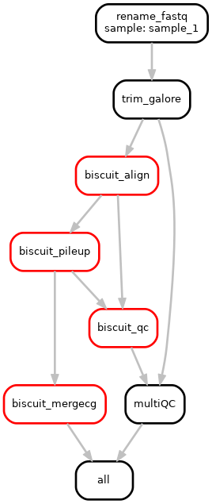

This Snakemake workflow takes paired-end whole-genome bisulfite sequencing (WGBS) data and processes it using BISulfite-seq CUI Toolkit (BISCUIT).

BISCUIT was written to perform alignment, DNA methylation and mutation calling, and allele specific methylation from bisulfite sequencing data (https://huishenlab.github.io/biscuit/).

Download BISCUIT here: https://github.com/huishenlab/biscuit/releases/latest.

# Components of the workflow
	0. [default off] Modify and index genome reference to including methylation controls
	1. [default off] Trim adapters and/or hard clip R2
	2. Alignment, duplicate tagging, indexing, flagstat  (biscuitBlaster v1 and v2)
	3. Methylation information extraction (BED Format)
	4. Merge C annd G beta values in CpG dinucleotide context
	5. SNP and Epiread extraction
	6. MultiQC with BICUIT QC modules specifically for methyaltion data
	7. [default off] fastq_screen (using Bismark - https://www.bioinformatics.babraham.ac.uk/projects/fastq_screen/
	8. [default off] QC methylated and unmethylated controls

Many options can be easily specified in the config.yaml! Otherwise, the commands in the Snakefile can also be modified to meet different needs.

# Dependencies

 + BISCUIT
 + R with packages tidyverse, patchwork, and viridis (only required for plotting methylation controls)
 + SAMTools 
 + Snakemake 1.6.0 
 + samblaster
 + htslib
 + bedtools
 + pigz
 + parallel
 + bismark (only required if running fastq_screen)
 + fastq_screen (only required if running fastq_screen)
 + fastQC
 + multiQC
 + parallel

# Running the workflow

+ Clone the repo `git clone https://github.com/vari-bbc/WGBS_Biscuit_Snakemake`

+ Place *gzipped* FASTQ files into `raw_data/`

+ Replace the example `bin/samples.tsv` with your own sample sheet containing:
	+ A row for each sample
	+ The following three columns
		+ A. `sample_1`
		+ B. `fq1` (name of R1 file for `sample_1` in `raw_data/`)
		+ C. `fq2` (name of R2 file for `sample_1` in `raw_data/`)
		+ D. Any other columns included are ignored
		
		
+ Modify the config.yaml to specify the appropriate 
	+ Reference genome
	+ Biscuit index
	+ Biscuit QC assets (https://github.com/huishenlab/biscuit/releases/tag/v0.3.16.20200420)
	+ Environmental modules (If modules are not available, snakemake gives a warning but will run successfully *as long as the required executables are in the path*)
	+ Toggle optional workflow components
	+ Set other run parameters in bin/config.yaml
	+ Turn on option rules in bin/config.yaml (change from False to True)

+ Run the first rule of Snakemake on the command line. This rule will collect the list of comma separated R1 and R2 files in bin/samples.tsv and rename them. This rule needs to be run *separately first* for the correct R1 and R2 files to be passed to biscuit_align. This rule takes only a few seconds per sample, and allows quick debugging of missing input files.
	+ `snakemake --cores 2 --use-envmodules --until get_R1_R2_files`
+ Then submit the rest workflow to an HPC using something similar to bin/run_snakemake_workflow.sh (e.g. qsub -q [queue_name] bin/run_snakemake_workflow.sh)

# After the workflow

+ The output files in analysis/pileup/ may be imported into a `BSseq` object using `bicuiteer::readBiscuit()`.
+ analysis/multiqc/multiqc_report.html contains the methylation-specific BISCUIT QC modules (https://huishenlab.github.io/biscuit/docs/alignment/QC.html)

# Test dataset

This workflow comes with a working example dataset. To test the smakemake workflow on your system, place the 10 *_R[12]_fq.gz files in bin/working_example_dataset into raw_data/ and use the default bin/samples.tsv. These example files can be mapped to the human genome.

# Diagrams of possible workflows

## Example workflow - 1 sample

# Helpful snakemake commands for debugging a workflow

snakemake -npr # test run

`snakemake --unlock --cores 1` # unlock after a manually aborted run

`snakemake --dag | dot -Tpng > my_dag.png` # create a workflow diagram for your run

`snakemake --use-envmodules --cores 1` # if running on the command line, need use-envmodules option

For more information on Snakemake: https://snakemake.readthedocs.io/en/stable/

