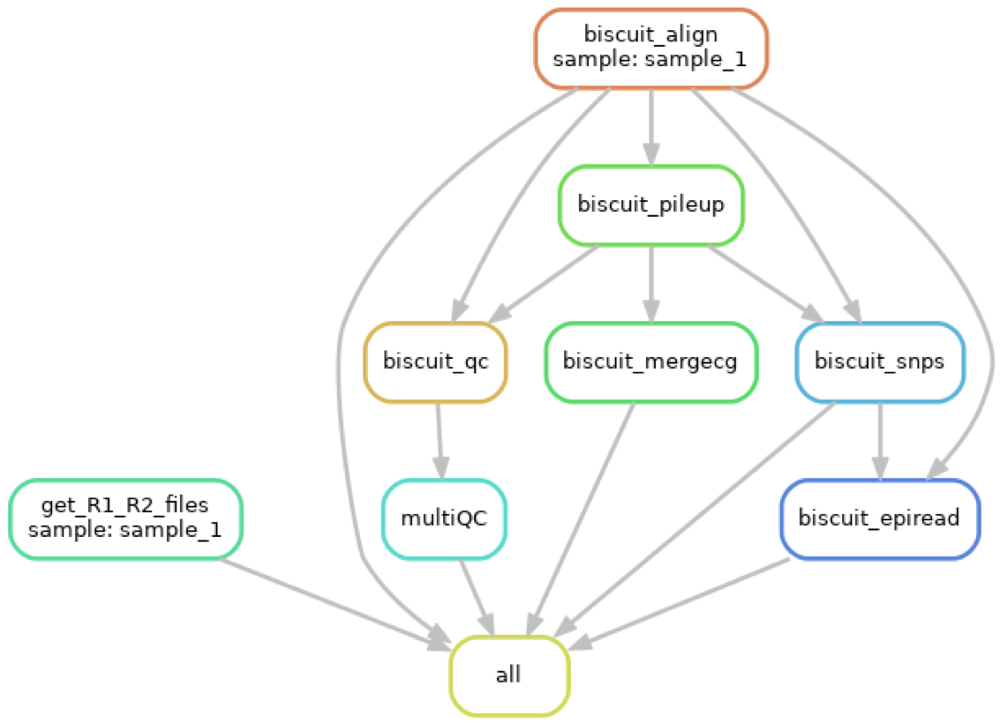

This Snakemake workflow takes paired-end whole-genome bisulfite sequencing (WGBS) data and processes it using
BISulfite-seq CUI Toolkit (BISCUIT).

BISCUIT was written to perform alignment, DNA methylation and mutation calling, and allele specific methylation from
bisulfite sequencing data (https://huishenlab.github.io/biscuit/).

Download BISCUIT here: https://github.com/huishenlab/biscuit/releases/latest.

# Components of the workflow
The following components are generally in order, but may run in a different order, depending on exact dependencies
needed.
  + [default off] Generate asset files used during QC related rules
  + [default off] Modify and index genome reference to including methylation controls
  + [default off] Trim adapters and/or hard clip R2
  + [default off] Run Fastq Screen in bisulfite mode
  + Run FastQC on raw FASTQ files
  + Alignment, duplicate tagging, indexing, flagstat of input data (biscuitBlaster v1 and v2)
  + Methylation information extraction (BED Format)
  + Merge C and G beta values in CpG dinucleotide context
  + [default off] SNP and Epiread extraction
  + [default off] Run Preseq on aligned BAM
  + MultiQC with BICUIT QC modules specifically for methyaltion data
  + [default off] Generate plots of the observed / expected coverage ratio for different genomic features
  + [default off] Generate percentage of covered CpGs and CpG island coverage figures
  + [default off] QC methylated and unmethylated controls

Many options can be easily specified in the `config.yaml`! Otherwise, the commands in the Snakefile can also be modified
to meet different needs.

# Dependencies
The following dependencies are downloaded when running with `--use-conda`, otherwise you must have these in your PATH.
  + `snakemake` (version 6.0+)
  + `biscuit` (version 1.0.1+)
  + `htslib` (version 1.12+)
  + `samtools` (version 1.12+)
  + `samblaster`
  + `parallel` (preferably version 20201122)
  + `bedtools`
  + `preseq` (version 3.1.2+)
  + `fastqc`
  + `trim_galore`
  + `fastq_screen` (only required if running `fastq_screen`)
  + `bismark` (only required if running `fastq_screen`)
  + `pigz`
  + `python` (version 3.7+)
    + `pandas`
    + `numpy`
    + `matplotlib`
  + `multiqc`
  + `R` (version 4.1.1+)
    + `tidyverse` (only required for plotting methylation controls)
    + `ggplot2` (only required for plotting methylation controls)
    + `patchwork` (only required for plotting methylation controls)
    + `viridislite` (only required for plotting methylation controls)

# Running the workflow
+ Clone the repo (https://github.com/huishenlab/Biscuit_Snakemake_Workflow/tree/master).
  + `git clone git@github.com:huishenlab/Biscuit_Snakemake_Workflow.git (SSH)`
  + `git clone https://github.com/huishenlab/Biscuit_Snakemake_Workflow.git (HTTPS)`
   

+ Place *gzipped* FASTQ files into `raw_data/`. Alternatively, you can specify the location of your *gzipped* FASTQ
files in `config/config.yaml`.

+ Replace the example `config/samples.tsv` with your own sample sheet containing:
  + A row for each sample
  + The following three columns for each row:
    + A. `sample`
    + B. `fq1` (name of R1 file for `sample` in your raw data directory)
    + C. `fq2` (name of R2 file for `sample` in your raw data directory)
    + D. Any other columns included are ignored
Note, you can either edit `config/samples.tsv` in place or specify the path to your sample sheet in
`config/config.yaml`. If you create your own sample sheet, make sure to include the header line as is seen in the
example file.

+ Modify the config.yaml to specify the appropriate
  + Reference genome
  + Biscuit index
  + Biscuit QC assets (https://github.com/huishenlab/biscuit/releases/latest)
  + Toggle optional workflow components
  + Set other run parameters in `config/config.yaml`
  + Turn on optional rules in `config/config.yaml` (change from False to True)
  + If you are using environmental modules on your system, you can set the locations in the corresponding location. By
  default, the pipeline will use `conda`/`mamba` to download the required packages. Note, if using the modules and a
  module is not available, snakemake gives a warning but will run successfully *as long as the required executables are
  in the path*.

+ Then submit the rest workflow to an HPC using something similar to `bin/run_snakemake_workflow.sh` (e.g.,
`qsub -q [queue_name] bin/run_snakemake_workflow.sh`). `bin/run_snakemake_workflow.sh` works for a PBS/Torque queue
system, but will need to be modifed to work with a Slurm or other system.

# After the workflow

+ The output files in `config['output_directory']/analysis/pileup/` may be imported into a `BSseq` object using
`bicuiteer::readBiscuit()`.
+ `config['output_directory']/analysis/multiqc/multiqc_report.html` contains the methylation-specific BISCUIT QC modules
(https://huishenlab.github.io/biscuit/docs/alignment/QC.html)

# Test dataset

This workflow comes with a working example dataset. To test the smakemake workflow on your system, place the 10
FASTQ files in `bin/working_example_dataset` into `raw_data/` and use the default `config/samples.tsv` sample sheet.
These example files can be mapped to the human genome.

# Example workflow - 1 sample

# Helpful snakemake commands for debugging a workflow
For more information on Snakemake: https://snakemake.readthedocs.io/en/stable/

  + Do a test run: `snakemake -npr`
  + Unlock directory after a manually aborted run: `snakemake --unlock --cores 1`
  + Create a workflow diagram for your run: `snakemake --dag | dot -Tpng > my_dag.png`
  + Run pipeline from the command line: `snakemake --use-conda --cores 1`
